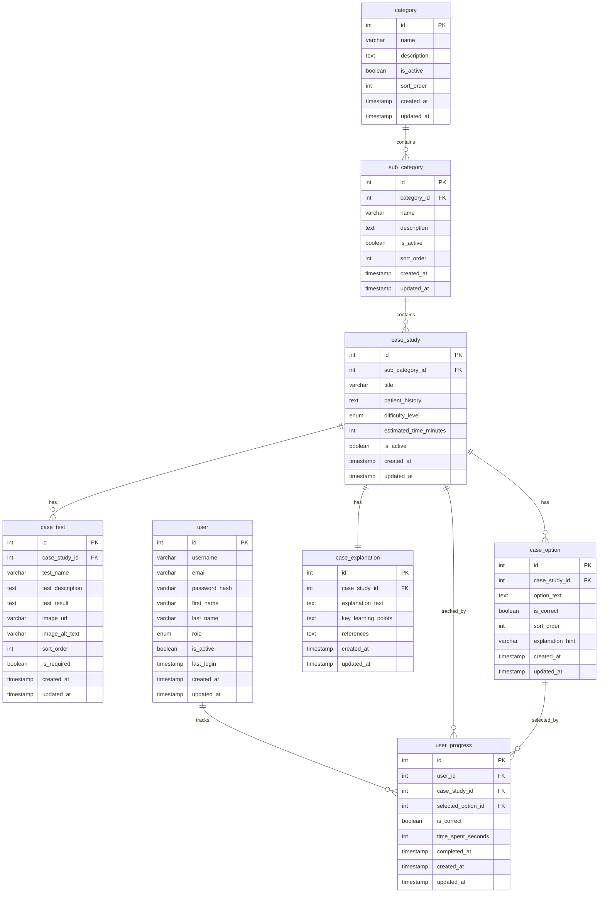

# راهنمای بصری‌سازی طرح پایگاه داده دامپزشکی

## روش‌های بصری‌سازی ERD

### 1. ابزارهای آنلاین رایگان

#### **dbdiagram.io** (توصیه شده)
- **لینک**: https://dbdiagram.io
- **مزایا**: رایگان، رابط کاربری ساده، پشتیبانی از MySQL
- **نحوه استفاده**:
  1. به سایت بروید
  2. روی "Create New Diagram" کلیک کنید
  3. کد زیر را در قسمت SQL وارد کنید:

```sql
// Veterinary Case Study Database Schema
Table category {
  id int [pk, increment]
  name varchar(100) [not null, unique]
  description text
  is_active boolean [default: true]
  sort_order int [default: 0]
  created_at timestamp [default: `now()`]
  updated_at timestamp [default: `now()`]
}

Table sub_category {
  id int [pk, increment]
  category_id int [ref: > category.id]
  name varchar(100) [not null]
  description text
  is_active boolean [default: true]
  sort_order int [default: 0]
  created_at timestamp [default: `now()`]
  updated_at timestamp [default: `now()`]
}

Table case_study {
  id int [pk, increment]
  sub_category_id int [ref: > sub_category.id]
  title varchar(255) [not null]
  patient_history text [not null]
  difficulty_level enum('beginner', 'intermediate', 'advanced') [default: 'intermediate']
  estimated_time_minutes int [default: 15]
  is_active boolean [default: true]
  created_at timestamp [default: `now()`]
  updated_at timestamp [default: `now()`]
}

Table case_test {
  id int [pk, increment]
  case_study_id int [ref: > case_study.id]
  test_name varchar(255) [not null]
  test_description text
  test_result text
  image_url varchar(500)
  image_alt_text varchar(255)
  sort_order int [default: 0]
  is_required boolean [default: true]
  created_at timestamp [default: `now()`]
  updated_at timestamp [default: `now()`]
}

Table case_option {
  id int [pk, increment]
  case_study_id int [ref: > case_study.id]
  option_text text [not null]
  is_correct boolean [default: false]
  sort_order int [default: 0]
  explanation_hint varchar(255)
  created_at timestamp [default: `now()`]
  updated_at timestamp [default: `now()`]
}

Table case_explanation {
  id int [pk, increment]
  case_study_id int [ref: > case_study.id, unique]
  explanation_text text [not null]
  key_learning_points text
  references text
  created_at timestamp [default: `now()`]
  updated_at timestamp [default: `now()`]
}

Table user {
  id int [pk, increment]
  username varchar(50) [unique]
  email varchar(255) [unique]
  password_hash varchar(255)
  first_name varchar(100)
  last_name varchar(100)
  role enum('student', 'instructor', 'admin') [default: 'student']
  is_active boolean [default: true]
  last_login timestamp
  created_at timestamp [default: `now()`]
  updated_at timestamp [default: `now()`]
}

Table user_progress {
  id int [pk, increment]
  user_id int [ref: > user.id]
  case_study_id int [ref: > case_study.id]
  selected_option_id int [ref: > case_option.id]
  is_correct boolean
  time_spent_seconds int
  completed_at timestamp [default: `now()`]
  created_at timestamp [default: `now()`]
  updated_at timestamp [default: `now()`]
}
```

#### **Lucidchart**
- **لینک**: https://www.lucidchart.com
- **مزایا**: ابزار حرفه‌ای، قالب‌های آماده
- **نحوه استفاده**: از قالب "Database ERD" استفاده کنید

#### **Draw.io (diagrams.net)**
- **لینک**: https://app.diagrams.net
- **مزایا**: رایگان، پشتیبانی از Google Drive
- **نحوه استفاده**: از قالب "Entity Relationship" استفاده کنید

### 2. ابزارهای دسکتاپ

#### **MySQL Workbench**
- **دانلود**: https://dev.mysql.com/downloads/workbench/
- **مزایا**: رسمی MySQL، پشتیبانی کامل از MySQL
- **نحوه استفاده**:
  1. MySQL Workbench را نصب کنید
  2. فایل `database_schema.sql` را import کنید
  3. از منوی Database > Reverse Engineer استفاده کنید

#### **DBeaver**
- **دانلود**: https://dbeaver.io
- **مزایا**: رایگان، پشتیبانی از چندین پایگاه داده
- **نحوه استفاده**: از قابلیت ERD استفاده کنید

### 3. ابزارهای کد

#### **Mermaid.js**
برای استفاده در Markdown یا مستندات:



### 4. اسکریپت Python برای تولید ERD

```python
# install: pip install eralchemy2
from eralchemy2 import render_er

# تعریف روابط
relationships = """
[category] *--* [sub_category]
[sub_category] *--* [case_study]
[case_study] *--* [case_test]
[case_study] *--* [case_option]
[case_study] ||--|| [case_explanation]
[user] *--* [user_progress]
[case_study] *--* [user_progress]
[case_option] *--* [user_progress]
"""

# تعریف جداول
tables = """
[category] {
    int id PK
    varchar name
    text description
    boolean is_active
    int sort_order
    timestamp created_at
    timestamp updated_at
}

[sub_category] {
    int id PK
    int category_id FK
    varchar name
    text description
    boolean is_active
    int sort_order
    timestamp created_at
    timestamp updated_at
}

[case_study] {
    int id PK
    int sub_category_id FK
    varchar title
    text patient_history
    enum difficulty_level
    int estimated_time_minutes
    boolean is_active
    timestamp created_at
    timestamp updated_at
}

[case_test] {
    int id PK
    int case_study_id FK
    varchar test_name
    text test_description
    text test_result
    varchar image_url
    varchar image_alt_text
    int sort_order
    boolean is_required
    timestamp created_at
    timestamp updated_at
}

[case_option] {
    int id PK
    int case_study_id FK
    text option_text
    boolean is_correct
    int sort_order
    varchar explanation_hint
    timestamp created_at
    timestamp updated_at
}

[case_explanation] {
    int id PK
    int case_study_id FK
    text explanation_text
    text key_learning_points
    text references
    timestamp created_at
    timestamp updated_at
}

[user] {
    int id PK
    varchar username
    varchar email
    varchar password_hash
    varchar first_name
    varchar last_name
    enum role
    boolean is_active
    timestamp last_login
    timestamp created_at
    timestamp updated_at
}

[user_progress] {
    int id PK
    int user_id FK
    int case_study_id FK
    int selected_option_id FK
    boolean is_correct
    int time_spent_seconds
    timestamp completed_at
    timestamp created_at
    timestamp updated_at
}
"""

# تولید ERD
render_er(tables + relationships, 'veterinary_erd.png')
```

## توصیه‌های بصری‌سازی

### 1. رنگ‌بندی
- **جداول اصلی**: آبی
- **جداول فرعی**: سبز
- **جداول کاربر**: نارنجی
- **روابط**: خطوط مشکی

### 2. چیدمان
- **سلسله مراتب**: از بالا به پایین
- **جداول مرتبط**: نزدیک به هم
- **فضای کافی**: بین جداول

### 3. برچسب‌گذاری
- **نام جداول**: واضح و کوتاه
- **روابط**: نوع رابطه (1:N, 1:1)
- **فیلدهای کلیدی**: برجسته

## نتیجه‌گیری

**توصیه من**: از **dbdiagram.io** استفاده کنید چون:
- رایگان است
- رابط کاربری ساده دارد
- پشتیبانی کامل از MySQL دارد
- می‌توانید کد SQL را مستقیماً وارد کنید
- امکان export به تصویر و PDF دارد 